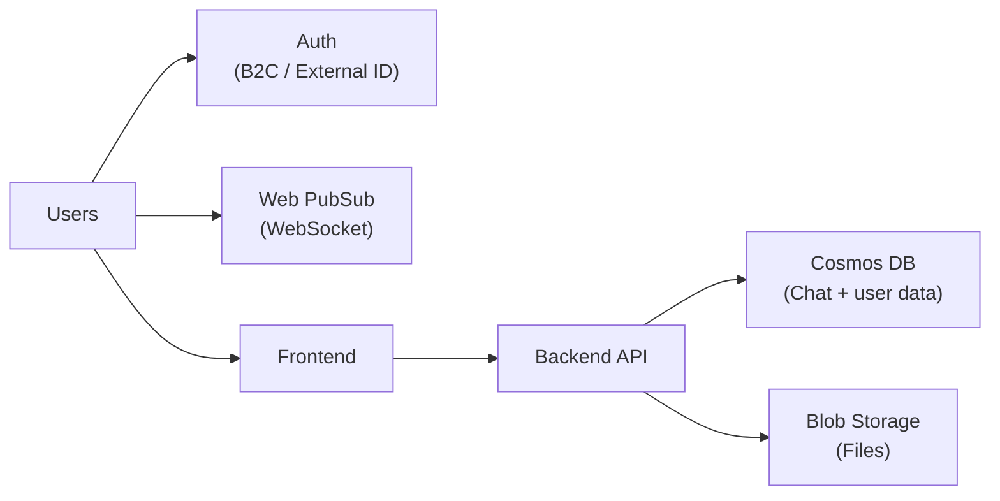

# Web Application: Real-time Live Chat (Text + Images + Documents)
### Core Idea
Build a web-based chat application where users can exchange text messages and share images/documents, with real-time delivery and cloud storage.

## Proposed Azure Technologies
- Identity & User Management:
Azure AD B2C or Microsoft Entra External ID (we will confirm the best fit during Phase 1)
&rarr; Handles sign-up/sign-in, profile attributes, and secure access.
- Real-time Messaging:
Azure Web PubSub (WebSocket)
&rarr; Provides real-time message delivery between connected clients.
- Database (Chat + App Data):
Azure Cosmos DB (JSON documents)
&rarr; Stores chat messages, conversation metadata, and user/session-related data.
- File Storage (Images/Documents):
Azure Blob Storage
&rarr; Stores uploaded files; application saves metadata/URLs in Cosmos DB.

## Key Features 
	•	Live chatting (real-time)
	•	User registration + login
	•	Account deletion
	•	User profile editing
	•	Upload + store images/documents in the cloud
	•	Chat history persistence (view previous messages)

## Work Plan by Phase (3 Phases)
### Phase 1 — Design + Research (Plan + Architecture)
Deliverables
	•	Application feature list + UI wireframe (high-level)
	•	Highlight architecture diagram (cloud services + data flow)
	•	Technology research: how each feature maps to Azure services
	•	Basic data model draft (Cosmos DB: message schema, user/profile schema)
	•	Risk list + decisions (e.g., AD B2C vs Entra External ID)
Submission: Feb 20, Presentation: Feb 27

### Phase 2 — Implementation + Deployment (MVP Build)
Deliverables
	•	Working deployed MVP (frontend + backend)
	•	User auth integrated (B2C / External ID)
	•	Web PubSub real-time messaging integrated
	•	Cosmos DB persistence for messages
	•	Blob Storage upload + retrieval (files/images)
	•	Deployment docs (how to run, environment variables)

### Phase 3 — Testing + Debugging + Documentation
Deliverables
	•	Functional testing (core flows + edge cases)
	•	Performance/latency observations (basic)
	•	Security checks (access control, file access patterns)
	•	User manual (how to use the app)
	•	Final report (architecture + deployment + testing summary)

